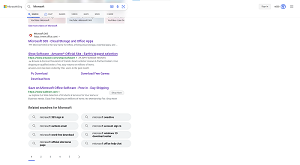

# ReBing

Bingを改良するブラウザ拡張機能。

**何ができますか？**

・Bingの検索結果ページではヘッダが固定されず、検索ボックスを呼び出したい時に少し面倒です。ReBingでは、ヘッダを固定します。

・その他多数追加予定。

**使用方法**

・開発者モードを使用してブラウザにインストールし、有効にします。

**動作環境**

・Microsoft Edge (Chromium版)

・Google Chrome

・その他Chromium系のブラウザで動作する場合があります。

***ライセンス***

・ライセンスを記載するほどの拡張機能ではありませんが、改造や二次配布などは常識の範囲内でお願いします。
